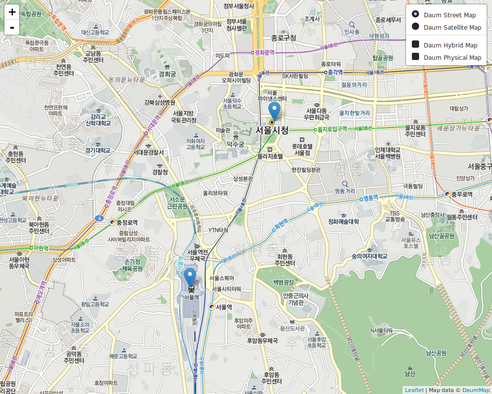

# rMapskr

`rMapskr`r is an R package to create, customize and publish interactive South Korea maps (Daum Map, Naver Map and VWorld Map) visualizations from R using a familiar lattice style plotting interface. `rMapskr` is modification version  of package rCharts.  
This package is under developement. 

## Installation

You can install `rMapskr` from `github` using the `devtools` package

```coffee
require(devtools)
install_github('dongikjang/rMapskr')
```


## Create

`rMapskr` uses a formula interface to specify plots, just like the `lattice` package. Here are a few examples you can try out in your R console.

### Daum Map

```coffee
require(rMapskr)

map3 <- Leaflet$new("daum")
#map3$setView(c(37.56641861115186, 126.97787362769193), zoom = 11)
map3$marker(c(37.5545355, 126.9706773), bindPopup = "<p> Seoul Station </p>")
map3$marker(c(37.5666208, 126.9783823), bindPopup = "<p> City Hall of Seoul </p>")
map3
```

### Naver Map

```coffee
require(rMapskr)

map3 <- Leaflet$new("naver")
#map3$setView(c(37.56641861115186, 126.97787362769193), zoom = 11)
map3$marker(c(37.5545355, 126.9706773), bindPopup = "<p> Seoul Station </p>")
map3$marker(c(37.5666208, 126.9783823), bindPopup = "<p> City Hall of Seoul </p>")
map3
```


### Vworld Map

```coffee
require(rMapskr)

map3 <- Leaflet$new("vworld")
#map3$setView(c(37.56641861115186, 126.97787362769193), zoom = 11)
map3$marker(c(37.5545355, 126.9706773), bindPopup = "<p> Seoul Station </p>")
map3$marker(c(37.5666208, 126.9783823), bindPopup = "<p> City Hall of Seoul </p>")
map3
```




```html
  <head>
    <link rel='stylesheet' href='inst/libraries/leaflet/external/leaflet.css'>
    <link rel='stylesheet' href='inst/libraries/leaflet/external/leaflet-rMapskr.css'>
    <link rel='stylesheet' href='inst/libraries/leaflet/external/legend.css'>
    
    <script src='inst/libraries/leaflet/external/leaflet-src.js' type='text/javascript'></script>
    <script src='inst/libraries/leaflet/lib/proj4-compressed.js' type='text/javascript'></script>
    <script src='inst/libraries/leaflet/lib/proj4leaflet.js' type='text/javascript'></script>
    <script src='inst/libraries/leaflet/lib/leaflet-providers.js' type='text/javascript'></script>
    <script src='inst/libraries/leaflet/src/Leaflet.KoreanTmsProviders.js' type='text/javascript'></script>
    
    <style>
    .rMapskr {
      display: block;
      margin-left: auto; 
      margin-right: auto;
      width: 1000px;
      height: 800px;
    }  
    </style>
    
  </head>
  <body >
    
    <div id = 'chart156ef76f40353' class = 'rMapskr leaflet'></div>    
    <script>
  	var spec = {
		"dom": "chart156ef76f40353",
		"width":           1000,
		"height":            800,
		"mapOpts": {
			"crs": L.Proj.CRS.TMS.Naver,
			"worldCopyJump": false,
			"continuousWorld": true,
			"zoomControl": true 
		},
		"center": [      37.566429,     126.977997 ],
		"zoom":              9,
		"id": "chart156ef76f40353" 
	}
	 
	var map = L.map(spec.dom, spec.mapOpts)

	var baseLayers = {
		'Naver Street Map': L.Proj.TileLayer.TMS.provider('NaverMap.Street').addTo(map),
		'Naver Satellite Map': L.Proj.TileLayer.TMS.provider('NaverMap.Satellite'),
		'Naver Hybrid Map': L.Proj.TileLayer.TMS.provider('NaverMap.Hybrid'),
		'Naver Cadastral Map': L.Proj.TileLayer.TMS.provider('NaverMap.Cadastral', null, {opacity : 1.0})

	};
	var overlayLayers = {
		'Naver Cadastral Map': L.Proj.TileLayer.TMS.provider('NaverMap.Cadastral')
	};
	L.control.layers(baseLayers, overlayLayers, {collapsed: false}).addTo(map);
    map.setView(spec.center, spec.zoom);
     
    L.marker([37.5545355, 126.9706773])
    	.addTo( map )
  		.bindPopup("<p> Seoul Station </p>")
	L.marker([37.5666208, 126.9783823])
		.addTo( map )
		.bindPopup("<p> City Hall of Seoul </p>")

    if (spec.circle2){
      for (var c in spec.circle2){
        var circle = L.circle(c.center, c.radius, c.opts)
         .addTo(map);
      }
    }
	</script>
  </body>
```

This work was inspired from <http://ramnathv.github.io/rCharts/>, <https://github.com/tontita/Leaflet.KoreanTmsProviders>, <http://plugins.qgis.org/plugins/tmsforkorea>, <https://github.com/leaflet-extras/leaflet-providers>, and <https://github.com/kartena/Proj4Leaflet>.
